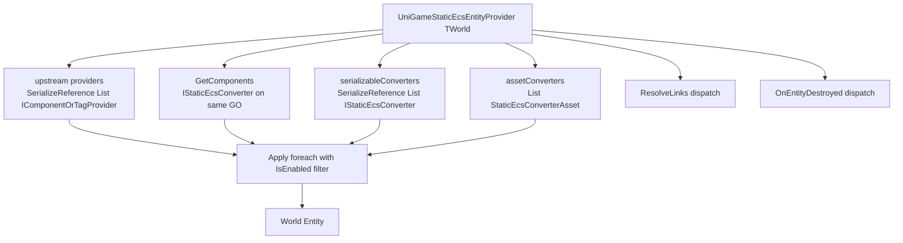

# UniGame Static ECS Unity

Unity runtime integration for `com.unigame.staticecs`.

This package owns Unity-facing bootstrap, authoring adapters, and demo-scene runtime bridge code.
It should reuse `com.felid-force-studios.static-ecs-unity` providers, debug view, templates, and type GUID tooling instead of duplicating them.

## Converter layer

Конвертерный слой живёт в `Runtime/Conversion`. Он строится поверх upstream `StaticEcsEntityProvider<TWorld>` / `IComponentOrTagProvider` и расширяет его одной точкой входа, в которой собираются:

- сериализованные `[SerializeReference]` конвертеры;
- ScriptableObject-конвертеры (включая пресеты);
- автоматически найденные mono-конвертеры на том же `GameObject`;
- runtime-зарегистрированные конвертеры (для динамически прибавляемых конвертеров).

### Базовые контракты

- [`IStaticEcsConverter<TWorld>`](Runtime/Conversion/IStaticEcsConverter.cs) — общий интерфейс с `IsEnabled` и `Apply(entity, host)`. Реализуется и mono-, и SO-, и сериализуемыми классами.
- [`IStaticEcsConverterDestroyHandler<TWorld>`](Runtime/Conversion/IStaticEcsConverter.cs) — опциональная очистка при разрушении сущности (вернуть pool, отписать listener).
- [`IStaticEcsLinkResolver<TWorld>`](Runtime/Conversion/IStaticEcsConverter.cs) — опциональный hook на втором проходе для конвертеров, которым нужно дописать link-зависимости после `CreateEntity` (см. ниже про link-resolve в пресетах).

### Базовая иерархия



### Корневой провайдер

[`UniGameStaticEcsEntityProvider<TWorld>`](Runtime/Conversion/UniGameStaticEcsEntityProvider.cs) наследуется от upstream `StaticEcsEntityProvider<TWorld>` и добавляет два сериализованных списка:

- `serializableConverters` — `[SerializeReference] List<IStaticEcsConverter<TWorld>>`;
- `assetConverters` — `[SerializeField] List<StaticEcsConverterAsset<TWorld>>` (ScriptableObject).

При `CreateEntity()`:

1. вызывается upstream `base.CreateEntity()` — он применяет свой собственный сериализованный `providers` (`ComponentProvider`/`TagProvider`/`LinkProvider`/...);
2. собирается единый список:
   - `GetComponents<IStaticEcsConverter<TWorld>>()` на том же `GameObject` (исключая сам провайдер);
   - все элементы `serializableConverters`;
   - все элементы `assetConverters`;
   - все элементы, добавленные через `RegisterRuntime(...)`;
3. для каждого конвертера, у которого `IsEnabled == true`, вызывается `Apply(entity, gameObject)`.

При `OnDestroy` корневой провайдер сначала диспатчит `IStaticEcsConverterDestroyHandler<TWorld>.OnEntityDestroyed` для всех собранных конвертеров (пока сущность ещё жива), затем выполняется upstream-логика разрушения сущности.

При `ResolveLinks` (post-create hook upstream) после стандартного `base.ResolveLinks()` вызываются все конвертеры, реализующие `IStaticEcsLinkResolver<TWorld>`.

Для каждого мира делается тонкий sealed-наследник, иначе Unity не привяжет generic MonoBehaviour к префабу:

```csharp
public sealed class GameEntityProvider : UniGameStaticEcsEntityProvider<GameWorld> { }
```

Для проектов с одним миром в пакете уже есть готовый non-generic `StaticEcsEntityProvider`, привязанный к дефолтному миру `Main` — см. секцию [Default world](#default-world).

### Mono-конвертер

[`StaticEcsMonoConverter<TWorld>`](Runtime/Conversion/StaticEcsMonoConverter.cs) — абстрактный `MonoBehaviour`, реализует `IStaticEcsConverter<TWorld>`. **Awake-регистрация больше не нужна** — корневой провайдер сам собирает конвертеры через `GetComponents` на том же `GameObject` в момент `CreateEntity`. Достаточно повесить mono-конвертер сиблингом провайдера.

`IsEnabled` по умолчанию = `_isEnabled && isActiveAndEnabled` (поле `_isEnabled` сериализуется и доступно в инспекторе).

Для типового кейса «один компонент, который собираем из живых Unity-ссылок» используйте `StaticEcsMonoConverter<TWorld, TComponent>` и переопределите `TComponent Build(GameObject host)`:

```csharp
public sealed class DemoMovementSpeedConverter
    : StaticEcsMonoConverter<Main, DemoMovementComponent> {
    [SerializeField] private float _speed = 5f;

    protected override DemoMovementComponent Build(GameObject host) {
        return new DemoMovementComponent { Speed = _speed, Velocity = Vector3.zero };
    }
}
```

Для общего паттерна «свяжи Transform с сущностью» уже есть [`TransformBindingConverter<TWorld>`](Runtime/Conversion/Bindings/TransformBindingConverter.cs); сделайте sealed-наследник под свой мир и системе достаточно прочитать `TransformBindingComponent.Transform`.

### ScriptableObject конвертеры

[`StaticEcsConverterAsset<TWorld>`](Runtime/Conversion/StaticEcsConverterAsset.cs) — абстрактная база для SO-конвертеров. Реализует `IStaticEcsConverter<TWorld>` и попадает напрямую в `assetConverters` корневого провайдера — никаких дополнительных MonoBehaviour-обёрток не нужно.

```csharp
[CreateAssetMenu(menuName = "Game/Converters/Stat Setup")]
public sealed class GameStatSetupAsset : StaticEcsConverterAsset {
    [SerializeField] private float _baseHealth = 100f;

    public override void Apply(World<Main>.Entity entity, GameObject host) {
        entity.Set(new HealthComponent { Value = _baseHealth });
    }
}
```

### Пресеты как nested-конвертеры

[`StaticEcsConverterPreset<TWorld>`](Runtime/Conversion/Presets/StaticEcsConverterPreset.cs) — наследник `StaticEcsConverterAsset<TWorld>`. Хранит:

- `[SerializeReference] List<IComponentOrTagProvider> providers` — поддерживаются стандартные `ComponentProvider`/`TagProvider`/`MultiProvider`;
- `[SerializeReference] List<IStaticEcsConverter<TWorld>> nestedConverters` — любые конвертеры, реализующие общий интерфейс (включая другие пресеты, переданные через ссылку на SO).

Поскольку пресет сам реализует `IStaticEcsConverter<TWorld>`, его можно положить и в `assetConverters` корневого провайдера, и в `nestedConverters` другого пресета — пайплайн обходит вложенность рекурсивно через единую `Apply`-точку.

Известное ограничение: `LinkProvider`/`LinksProvider` upstream — `internal`, поэтому второй проход link-resolve внутри пресета не реализован. Для link-зависимостей используйте upstream-`providers` корневого провайдера (он резолвится через стандартный `ResolveLinks`) или собственный конвертер с `IStaticEcsLinkResolver<TWorld>`.

### Cleanup

Конвертер, реализующий `IStaticEcsConverterDestroyHandler<TWorld>`, получает `OnEntityDestroyed(entity, host)` непосредственно перед тем, как корневой провайдер дёрнет upstream-разрушение сущности. Для триггера достаточно `OnDestroyType.DestroyEntity` на провайдере; единая точка диспатча — `OnDestroy` корневого `UniGameStaticEcsEntityProvider`.

### Runtime-регистрация

Если конвертер создаётся в коде (а не висит на префабе), используйте `provider.RegisterRuntime(converter)` до момента, когда провайдер выполнит `CreateEntity`. Список пересобирается в каждом `CreateEntity`, поэтому повторное создание сущности видит актуальный набор. `UnregisterRuntime` снимает конвертер.

### Проверочный чек-лист

- наследник `UniGameStaticEcsEntityProvider<TWorld>` стоит на префабе и виден в Static ECS View;
- mono-конвертеры являются сиблингами провайдера на том же `GameObject` (под-объекты не сканируются);
- generic-классы (`StaticEcsMonoConverter<,,>`, `TransformBindingConverter<>`, `StaticEcsConverterAsset<>`, `StaticEcsConverterPreset<>`) на префабах/SO не используются напрямую — только через sealed-наследников;
- системе, которая читает Unity-ссылку, достаточно `entity.Read<TransformBindingComponent>()` или собственного компонента, заполненного конвертером, — никаких side-channel registries не нужно;
- link-зависимости лежат в upstream-`providers` корневого провайдера, а не в пресете.

## Default world

В single-world проектах не нужно тащить generic-боилерплейт. Пакет включает marker-тип [`Main`](Runtime/Main.cs):

```csharp
public struct Main : IWorldType { }
```

…и готовые non-generic фасады, привязанные к нему:

| Generic API (multi-world) | Non-generic фасад (`Main`) |
| --- | --- |
| `UniGameStaticEcsEntityProvider<TWorld>` | [`StaticEcsEntityProvider`](Runtime/Conversion/StaticEcsEntityProvider.cs) |
| `StaticEcsServiceSource<TWorld>` | [`StaticEcsServiceSource`](Runtime/Bootstrap/StaticEcsServiceSource.cs) |
| `StaticEcsModuleConfig<TWorld>` | [`StaticEcsModule`](Runtime/Config/StaticEcsModule.cs) |
| `StaticEcsMonoConverter<TWorld>` / `<TWorld, TComponent>` | [`StaticEcsMonoConverter`](Runtime/Conversion/StaticEcsMonoConverter.cs) (без компонента) / `StaticEcsMonoConverter<Main, TComponent>` |
| `StaticEcsConverterAsset<TWorld>` | [`StaticEcsConverterAsset`](Runtime/Conversion/StaticEcsConverterAsset.cs) |
| `StaticEcsConverterPreset<TWorld>` | [`StaticEcsConverterPreset`](Runtime/Conversion/Presets/StaticEcsConverterPreset.cs) |
| `TransformBindingConverter<TWorld>` | [`TransformBindingConverter`](Runtime/Conversion/Bindings/TransformBindingConverter.cs) |

Multi-world проекты пользуются generic-веткой как раньше; non-generic классы — обычные `sealed`-обёртки и не ломают расширяемость.
