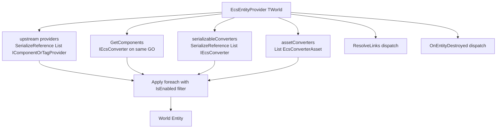

# UniGame Static ECS Unity

Unity-facing слой `com.unigame.staticecs`: bootstrap, конвертеры, инспекторы, окна и menu-команды.

- `Runtime/` (asmdef `unigame.staticecs.unity`) — рантайм: bootstrap, сервис, runner, конвертерный слой, marker `Main`.
- `Editor/` (asmdef `unigame.staticecs.editor`, Editor-only) — property drawers, инспекторы, окна и menu-tooling. Раньше жил в отдельном пакете `com.unigame.staticecs.editor`; теперь подтянут сюда же и идёт в той же версии.

Базис — upstream `com.felid-force-studios.static-ecs-unity`. Этот пакет не дублирует upstream-провайдеры/debug view/шаблоны/GUID-tooling, а расширяет их.

## Converter layer

Конвертерный слой живёт в `Runtime/Conversion`. Он строится поверх upstream `StaticEcsEntityProvider<TWorld>` / `IComponentOrTagProvider` и расширяет его одной точкой входа, в которой собираются:

- сериализованные `[SerializeReference]` конвертеры;
- ScriptableObject-конвертеры (включая пресеты);
- автоматически найденные mono-конвертеры на том же `GameObject`;
- runtime-зарегистрированные конвертеры (для динамически прибавляемых конвертеров).

### Базовые контракты

- [`IEcsConverter<TWorld>`](Runtime/Conversion/IEcsConverter.cs) — общий интерфейс с `IsEnabled` и `Apply(entity, host)`. Реализуется и mono-, и SO-, и сериализуемыми классами.
- [`IEcsConverterDestroyHandler<TWorld>`](Runtime/Conversion/IEcsConverter.cs) — опциональная очистка при разрушении сущности (вернуть pool, отписать listener).
- [`IEcsLinkResolver<TWorld>`](Runtime/Conversion/IEcsConverter.cs) — опциональный hook на втором проходе для конвертеров, которым нужно дописать link-зависимости после `CreateEntity` (см. ниже про link-resolve в пресетах).

### Базовая иерархия



### Корневой провайдер

[`EcsEntityProvider<TWorld>`](Runtime/Conversion/EcsEntityProvider.cs) наследуется от upstream `StaticEcsEntityProvider<TWorld>` и добавляет два сериализованных списка:

- `serializableConverters` — `[SerializeReference] List<IEcsConverter<TWorld>>`;
- `assetConverters` — `[SerializeField] List<EcsConverterAsset<TWorld>>` (ScriptableObject).

При `CreateEntity()`:

1. вызывается upstream `base.CreateEntity()` — он применяет свой собственный сериализованный `providers` (`ComponentProvider`/`TagProvider`/`LinkProvider`/...);
2. собирается единый список:
   - `GetComponents<IEcsConverter<TWorld>>()` на том же `GameObject` (исключая сам провайдер);
   - все элементы `serializableConverters`;
   - все элементы `assetConverters`;
   - все элементы, добавленные через `RegisterRuntime(...)`;
3. для каждого конвертера, у которого `IsEnabled == true`, вызывается `Apply(entity, gameObject)`.

При `OnDestroy` корневой провайдер сначала диспатчит `IEcsConverterDestroyHandler<TWorld>.OnEntityDestroyed` для всех собранных конвертеров (пока сущность ещё жива), затем выполняется upstream-логика разрушения сущности.

При `ResolveLinks` (post-create hook upstream) после стандартного `base.ResolveLinks()` вызываются все конвертеры, реализующие `IEcsLinkResolver<TWorld>`.

Если префаб инстанцируется до того, как Static ECS-сервис поднимется (`World<TWorld>.Status != Initialized`), `EcsEntityProvider` ставит создание сущности в отложенный режим и автоматически выполняет его на ближайшем `Update` после готовности мира — `Awake`/`Start` upstream больше не пишут warning.

Для каждого мира делается тонкий sealed-наследник, иначе Unity не привяжет generic MonoBehaviour к префабу:

```csharp
public sealed class GameEntityProvider : EcsEntityProvider<GameWorld> { }
```

Для проектов с одним миром в пакете уже есть готовый non-generic `StaticEcsEntityProvider`, привязанный к дефолтному миру `Main` — см. секцию [Default world](#default-world).

### Mono-конвертер

[`EcsMonoConverter<TWorld>`](Runtime/Conversion/EcsMonoConverter.cs) — абстрактный `MonoBehaviour`, реализует `IEcsConverter<TWorld>`. **Awake-регистрация не нужна** — корневой провайдер сам собирает конвертеры через `GetComponents` на том же `GameObject` в момент `CreateEntity`. Достаточно повесить mono-конвертер сиблингом провайдера.

`IsEnabled` по умолчанию = `_isEnabled && isActiveAndEnabled` (поле `_isEnabled` сериализуется и доступно в инспекторе).

Для типового кейса «один компонент, который собираем из живых Unity-ссылок» используйте `EcsMonoConverter<TWorld, TComponent>` и переопределите `TComponent Build(GameObject host)`:

```csharp
public sealed class DemoMovementSpeedConverter
    : EcsMonoConverter<Main, DemoMovementComponent> {
    [SerializeField] private float _speed = 5f;

    protected override DemoMovementComponent Build(GameObject host) {
        return new DemoMovementComponent { Speed = _speed, Velocity = Vector3.zero };
    }
}
```

Для общего паттерна «свяжи Transform с сущностью» уже есть [`TransformBindingConverter<TWorld>`](Runtime/Conversion/Bindings/TransformBindingConverter.cs); сделайте sealed-наследник под свой мир и системе достаточно прочитать `TransformBindingComponent.Transform`.

### ScriptableObject конвертеры

[`EcsConverterAsset<TWorld>`](Runtime/Conversion/EcsConverterAsset.cs) — абстрактная база для SO-конвертеров. Реализует `IEcsConverter<TWorld>` и попадает напрямую в `assetConverters` корневого провайдера — никаких дополнительных MonoBehaviour-обёрток не нужно.

```csharp
[CreateAssetMenu(menuName = "Game/Converters/Stat Setup")]
public sealed class GameStatSetupAsset : EcsConverterAsset {
    [SerializeField] private float _baseHealth = 100f;

    public override void Apply(World<Main>.Entity entity, GameObject host) {
        entity.Set(new HealthComponent { Value = _baseHealth });
    }
}
```

### Пресеты как nested-конвертеры

[`EcsConverterPreset<TWorld>`](Runtime/Conversion/Presets/EcsConverterPreset.cs) — наследник `EcsConverterAsset<TWorld>`. Хранит:

- `[SerializeReference] List<IComponentOrTagProvider> providers` — поддерживаются стандартные `ComponentProvider`/`TagProvider`/`MultiProvider`;
- `[SerializeReference] List<IEcsConverter<TWorld>> nestedConverters` — любые конвертеры, реализующие общий интерфейс (включая другие пресеты, переданные через ссылку на SO).

Поскольку пресет сам реализует `IEcsConverter<TWorld>`, его можно положить и в `assetConverters` корневого провайдера, и в `nestedConverters` другого пресета — пайплайн обходит вложенность рекурсивно через единую `Apply`-точку.

Известное ограничение: `LinkProvider`/`LinksProvider` upstream — `internal`, поэтому второй проход link-resolve внутри пресета не реализован. Для link-зависимостей используйте upstream-`providers` корневого провайдера (он резолвится через стандартный `ResolveLinks`) или собственный конвертер с `IEcsLinkResolver<TWorld>`.

### Cleanup

Конвертер, реализующий `IEcsConverterDestroyHandler<TWorld>`, получает `OnEntityDestroyed(entity, host)` непосредственно перед тем, как корневой провайдер дёрнет upstream-разрушение сущности. Для триггера достаточно `OnDestroyType.DestroyEntity` на провайдере; единая точка диспатча — `OnDestroy` корневого `EcsEntityProvider`.

### Runtime-регистрация

Если конвертер создаётся в коде (а не висит на префабе), используйте `provider.RegisterRuntime(converter)` до момента, когда провайдер выполнит `CreateEntity`. Список пересобирается в каждом `CreateEntity`, поэтому повторное создание сущности видит актуальный набор. `UnregisterRuntime` снимает конвертер.

### Проверочный чек-лист

- наследник `EcsEntityProvider<TWorld>` стоит на префабе и виден в Static ECS View;
- mono-конвертеры являются сиблингами провайдера на том же `GameObject` (под-объекты не сканируются);
- generic-классы (`EcsMonoConverter<,,>`, `TransformBindingConverter<>`, `EcsConverterAsset<>`, `EcsConverterPreset<>`) на префабах/SO не используются напрямую — только через sealed-наследников;
- системе, которая читает Unity-ссылку, достаточно `entity.Read<TransformBindingComponent>()` или собственного компонента, заполненного конвертером, — никаких side-channel registries не нужно;
- link-зависимости лежат в upstream-`providers` корневого провайдера, а не в пресете.

## Default world

В single-world проектах не нужно тащить generic-боилерплейт. Пакет включает marker-тип [`Main`](Runtime/Main.cs):

```csharp
public struct Main : IWorldType { }
```

…и готовые non-generic фасады, привязанные к нему:

| Generic API (multi-world) | Non-generic фасад (`Main`) |
| --- | --- |
| `EcsEntityProvider<TWorld>` | [`StaticEcsEntityProvider`](Runtime/Conversion/StaticEcsEntityProvider.cs) |
| `StaticEcsServiceSource<TWorld>` | [`StaticEcsServiceSource`](Runtime/Bootstrap/StaticEcsServiceSource.cs) |
| `StaticEcsModuleConfig<TWorld>` | [`StaticEcsModule`](Runtime/Config/StaticEcsModule.cs) |
| `EcsMonoConverter<TWorld>` / `<TWorld, TComponent>` | [`EcsMonoConverter`](Runtime/Conversion/EcsMonoConverter.cs) (без компонента) / `EcsMonoConverter<Main, TComponent>` |
| `EcsConverterAsset<TWorld>` | [`EcsConverterAsset`](Runtime/Conversion/EcsConverterAsset.cs) |
| `EcsConverterPreset<TWorld>` | [`EcsConverterPreset`](Runtime/Conversion/Presets/EcsConverterPreset.cs) |
| `TransformBindingConverter<TWorld>` | [`TransformBindingConverter`](Runtime/Conversion/Bindings/TransformBindingConverter.cs) |

Multi-world проекты пользуются generic-веткой как раньше; non-generic классы — обычные `sealed`-обёртки и не ломают расширяемость.

## Service

[`IEcsService`](Runtime/Service/IEcsService.cs) — публикуемый в `IContext` сервис. Конкретная реализация — generic [`EcsService<TWorld>`](Runtime/Service/EcsService.cs); поднимается из `StaticEcsServiceSource<TWorld>` или non-generic `StaticEcsServiceSource` (мир `Main`). Для отладки последний поднявшийся сервис доступен через [`EcsServiceRegistry.Active`](Runtime/Service/EcsServiceRegistry.cs) и `EcsServiceRegistry.LastReport` ([`EcsStartupReport`](Runtime/Service/EcsStartupReport.cs)). Тики обоих pipeline'ов гонит [`EcsRunner<TWorld>`](Runtime/Service/EcsRunner.cs) на `PlayerLoopTiming` из `StaticEcsSystemsConfig`.

## Editor tooling

Editor-сборка (`Editor/unigame.staticecs.editor.asmdef`) подгружается только в Editor и зависит от `unigame.staticecs`, `unigame.staticecs.unity`, upstream `FFS.StaticEcs.Unity.Editor` и `unigame.contextdata.runtime`.

### Property drawers

В `Editor/Drawers/` лежат `[CustomPropertyDrawer]` для конфигов из `Runtime/Config`:

- [`StaticEcsWorldConfigDrawer`](Editor/Drawers/StaticEcsWorldConfigDrawer.cs) — `StaticEcsWorldConfig` (capacity / threading);
- [`StaticEcsSystemsConfigDrawer`](Editor/Drawers/StaticEcsSystemsConfigDrawer.cs) — `StaticEcsSystemsConfig` (включение pipeline'ов update/fixed/late/cleanup);
- [`StaticEcsModuleConfigDrawer`](Editor/Drawers/StaticEcsModuleConfigDrawer.cs) — компактная отрисовка элементов `List<StaticEcsModuleConfig>` в `StaticEcsServiceSource`.

Эти drawer'ы автоматически применяются к полям `world`, `systems`, `modules` любого `StaticEcsServiceSource` / `StaticEcsServiceSource<TWorld>`.

### Service source inspector

[`EcsServiceSourceInspector<TWorld>`](Editor/Validation/EcsServiceSourceInspector.cs) — базовый inspector с проверками:

- модули назначены и содержат хотя бы один enabled;
- нет дубликатов модулей;
- все модули совместимы с миром `TWorld` (наследуют `StaticEcsModuleConfig<TWorld>`).

Чтобы привязать его к своему `ServiceSource`, объявите `[CustomEditor(typeof(MyServiceSource))]`-наследника:

```csharp
[CustomEditor(typeof(StaticEcsServiceSource))]
public sealed class StaticEcsMainSourceInspector
    : EcsServiceSourceInspector<Main> { }
```

### Static ECS View с проектными вкладками

Upstream `StaticEcsView<TWorld, TEntityProvider, TEventProvider>` (FFS) — окно отладки. Расширение [`EcsView<TWorld, TEntityProvider, TEventProvider>`](Editor/View/EcsView.cs) добавляет туда проектные вкладки через рефлексию (private-поле `_tabs`):

- [`GameModulesTab`](Editor/View/Tabs/GameModulesTab.cs) — список модулей сервиса и их состояние (enabled / зарегистрированные типы);
- [`BootstrapReportTab`](Editor/View/Tabs/BootstrapReportTab.cs) — последний `EcsStartupReport` (success/world/modules/updates);
- [`FeatureCatalogTab<TWorld>`](Editor/View/Tabs/FeatureCatalogTab.cs) — каталог `IStaticEcsFeature<TWorld>`-реализаций, найденных через рефлексию.

Если upstream поменяет имя приватного поля, окно один раз залогирует warning и просто откроется без проектных вкладок — runtime не ломается. В таком случае нужно поднять версию `unigame.staticecs.unity` под актуальный upstream.

### Меню `Tools/UniGame/Static ECS`

[`EcsMenu`](Editor/Menu/EcsMenu.cs):

- `Tools/UniGame/Static ECS/Fix Broken Providers` — открывает upstream `BrokenProvidersFixerWindow` (поиск/починка `StaticEcsEntityProvider` с битыми ссылками после переименования компонентов).
- `Tools/UniGame/Static ECS/Documentation/Open Knowledge Base` — открывает локальную knowledge-base `docs/knowledge/static-ecs/index.md`.

### Зависимости

- `com.unigame.staticecs` — базовый рантайм;
- `com.unigame.staticecs.unity` (этот же пакет, Runtime asmdef);
- `com.unigame.contextdata` — `ServiceDataSourceAsset` для `StaticEcsServiceSource`;
- `com.unigame.unicore` — общие contracts;
- `com.cysharp.unitask` — `EcsRunner`;
- upstream `com.felid-force-studios.static-ecs-unity` — провайдеры, окно и инструменты, которые мы расширяем.

Editor-сборка ссылается дополнительно на `FFS.StaticEcs.Unity.Editor` (upstream Editor) и `unigame.contextdata.runtime`.

> Раньше Editor-часть жила в отдельном пакете `com.unigame.staticecs.editor`. Если на ней висели ссылки в проектных `manifest.json` / `*.asmdef` — снимите их: всё подтянется через `com.unigame.staticecs.unity`.
