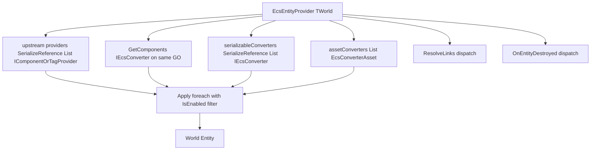

# UniGame Static ECS Unity

Unity-facing package for UniGame Static ECS: bootstrap, runtime service,
runner, conversion layer, editor inspectors, debug view extensions, and menu
commands.

- `Runtime/` (`unigame.staticecs.unity`) contains bootstrap, service, runner,
  converter layer, and the default `Main` world marker.
- `Editor/` (`unigame.staticecs.editor`, Editor-only) contains property drawers,
  inspectors, view tabs, validation, and menu tooling. This editor layer used to
  live in a separate `com.unigame.staticecs.editor` package and is now shipped
  together with `com.unigame.staticecs.unity`.

The package builds on upstream `com.felid-force-studios.static-ecs-unity`. It
does not duplicate upstream providers, debug views, templates, or GUID tooling;
it extends them with UniGame-specific service, converter, and editor workflows.

## Converter Layer

The converter layer lives in `Runtime/Conversion`. It wraps upstream
`StaticEcsEntityProvider<TWorld>` / `IComponentOrTagProvider` and adds one
composition point that collects:

- serialized `[SerializeReference]` converters;
- ScriptableObject converters, including presets;
- mono converters found on the same `GameObject`;
- runtime-registered converters for dynamic composition.

### Core Contracts

- [`IEcsConverter<TWorld>`](Runtime/Conversion/IEcsConverter.cs) is the common
  converter interface with `IsEnabled` and `Apply(entity, host)`. It is used by
  mono, ScriptableObject, and serializable converters.
- [`IEcsConverterDestroyHandler<TWorld>`](Runtime/Conversion/IEcsConverter.cs)
  is an optional cleanup hook called before the provider destroys the entity.
- [`IEcsLinkResolver<TWorld>`](Runtime/Conversion/IEcsConverter.cs) is an
  optional second-pass hook for converters that need to resolve links after
  `CreateEntity`.

### Converter Flow



### Root Provider

[`EcsEntityProvider<TWorld>`](Runtime/Conversion/EcsEntityProvider.cs) inherits
from upstream `StaticEcsEntityProvider<TWorld>` and adds two serialized lists:

- `serializableConverters`: `[SerializeReference] List<IEcsConverter<TWorld>>`;
- `assetConverters`: `[SerializeField] List<EcsConverterAsset<TWorld>>`.

On `CreateEntity()`:

1. upstream `base.CreateEntity()` applies its own serialized `providers`
   (`ComponentProvider`, `TagProvider`, `LinkProvider`, and related providers);
2. the provider builds a single converter list from:
   - `GetComponents<IEcsConverter<TWorld>>()` on the same `GameObject`, excluding
     the provider itself;
   - all `serializableConverters`;
   - all `assetConverters`;
   - all converters added through `RegisterRuntime(...)`;
3. every converter with `IsEnabled == true` receives `Apply(entity, gameObject)`.

On `OnDestroy`, the root provider dispatches
`IEcsConverterDestroyHandler<TWorld>.OnEntityDestroyed` while the entity is still
alive, then delegates to upstream entity destruction.

On `ResolveLinks`, after `base.ResolveLinks()`, the provider calls every
converter that implements `IEcsLinkResolver<TWorld>`.

If a prefab is instantiated before the Static ECS service is ready
(`World<TWorld>.Status != Initialized`), `EcsEntityProvider` defers entity
creation and retries on the next `Update` after the world is initialized.

Every world needs a thin sealed provider subtype because Unity cannot attach a
generic `MonoBehaviour` directly:

```csharp
public sealed class GameEntityProvider : EcsEntityProvider<GameWorld> { }
```

For single-world projects, this package provides non-generic facades bound to
the default `Main` world. See [Default World](#default-world).

### Mono Converters

[`EcsMonoConverter<TWorld>`](Runtime/Conversion/EcsMonoConverter.cs) is an
abstract `MonoBehaviour` implementing `IEcsConverter<TWorld>`. No Awake-time
registration is needed: the root provider collects converters with
`GetComponents` on the same `GameObject` when it creates the entity.

`IsEnabled` defaults to `_isEnabled && isActiveAndEnabled`.

For the common "build one component from Unity references" case, use
`EcsMonoConverter<TWorld, TComponent>` and override
`TComponent Build(GameObject host)`:

```csharp
public sealed class DemoMovementSpeedConverter
    : EcsMonoConverter<Main, DemoMovementComponent> {
    [SerializeField] private float _speed = 5f;

    protected override DemoMovementComponent Build(GameObject host) {
        return new DemoMovementComponent {
            Speed = _speed,
            Velocity = Vector3.zero
        };
    }
}
```

For the common "bind Transform to entity" case, use
[`TransformBindingConverter<TWorld>`](Runtime/Conversion/Bindings/TransformBindingConverter.cs)
through a sealed world-specific subtype. Systems can then read
`TransformBindingComponent.Transform`.

In EditMode tests that create entities manually without `EcsEntityProvider`,
register `TransformBindingComponent` explicitly before `World<TWorld>.Initialize()`:

```csharp
World<TestWorld>.Types().Component<TransformBindingComponent>();
```

This is required by feature tests for `TargetSelection` and `Ability` steps such
as `AoeQueryStepConfig` and `SetPrimaryTargetFromAoeStepConfig`, because those
systems read `TransformBindingComponent` directly.

### ScriptableObject Converters

[`EcsConverterAsset<TWorld>`](Runtime/Conversion/EcsConverterAsset.cs) is the
base class for ScriptableObject converters. It implements `IEcsConverter<TWorld>`
and can be placed directly into the root provider's `assetConverters` list.

```csharp
[CreateAssetMenu(menuName = "Game/Converters/Stat Setup")]
public sealed class GameStatSetupAsset : EcsConverterAsset {
    [SerializeField] private float _baseHealth = 100f;

    public override void Apply(World<Main>.Entity entity, GameObject host) {
        entity.Set(new HealthComponent { Value = _baseHealth });
    }
}
```

### Presets As Nested Converters

[`EcsConverterPreset<TWorld>`](Runtime/Conversion/Presets/EcsConverterPreset.cs)
inherits from `EcsConverterAsset<TWorld>` and stores:

- `[SerializeReference] List<IComponentOrTagProvider> providers` for upstream
  `ComponentProvider`, `TagProvider`, `MultiProvider`, and related providers;
- `[SerializeReference] List<IEcsConverter<TWorld>> nestedConverters` for any
  converter implementing the shared interface, including other presets.

Because a preset itself implements `IEcsConverter<TWorld>`, it can be placed in
the root provider's `assetConverters` list or nested inside another preset.

Known limitation: upstream `LinkProvider` / `LinksProvider` are `internal`, so
link-resolve inside presets is not implemented. Put link dependencies into the
root provider's upstream `providers` list, or write a custom converter that
implements `IEcsLinkResolver<TWorld>`.

### Cleanup

Converters implementing `IEcsConverterDestroyHandler<TWorld>` receive
`OnEntityDestroyed(entity, host)` right before the root provider delegates to
upstream entity destruction. `OnDestroyType.DestroyEntity` on the provider is
enough to trigger this unified cleanup path.

### Runtime Registration

If a converter is created in code rather than placed on a prefab, call
`provider.RegisterRuntime(converter)` before the provider creates the entity.
The converter list is rebuilt for each `CreateEntity`, so recreated entities see
the current runtime list. `UnregisterRuntime` removes the converter.

### Converter Checklist

- A sealed `EcsEntityProvider<TWorld>` subtype is attached to the prefab and is
  visible in Static ECS View.
- Mono converters are sibling components on the same `GameObject` as the
  provider. Child objects are not scanned.
- Generic classes such as `EcsMonoConverter<,,>`,
  `TransformBindingConverter<>`, `EcsConverterAsset<>`, and
  `EcsConverterPreset<>` are not used directly on prefabs or assets. Use sealed
  subtypes.
- Systems that read Unity references use `entity.Read<TransformBindingComponent>()`
  or another component filled by a converter. No side-channel registry is needed.
- Link dependencies belong to the root provider's upstream `providers`, not to a
  preset.

## Default World

Single-world projects do not need generic boilerplate. The package includes the
[`Main`](Runtime/Main.cs) marker:

```csharp
public struct Main : IWorldType { }
```

It also provides non-generic facades bound to `Main`:

| Generic API | Non-generic facade |
| --- | --- |
| `EcsEntityProvider<TWorld>` | [`StaticEcsEntityProvider`](Runtime/Conversion/StaticEcsEntityProvider.cs) |
| `StaticEcsServiceSource<TWorld>` | [`StaticEcsServiceSource`](Runtime/Bootstrap/StaticEcsServiceSource.cs) |
| `StaticEcsModuleConfig<TWorld>` | [`StaticEcsModule`](Runtime/Config/StaticEcsModule.cs) |
| `EcsMonoConverter<TWorld>` / `<TWorld, TComponent>` | [`EcsMonoConverter`](Runtime/Conversion/EcsMonoConverter.cs) / `EcsMonoConverter<Main, TComponent>` |
| `EcsConverterAsset<TWorld>` | [`EcsConverterAsset`](Runtime/Conversion/EcsConverterAsset.cs) |
| `EcsConverterPreset<TWorld>` | [`EcsConverterPreset`](Runtime/Conversion/Presets/EcsConverterPreset.cs) |
| `TransformBindingConverter<TWorld>` | [`TransformBindingConverter`](Runtime/Conversion/Bindings/TransformBindingConverter.cs) |

Multi-world projects keep using the generic branch. Non-generic classes are thin
sealed wrappers and do not limit extensibility.

## Service

[`IEcsService`](Runtime/Service/IEcsService.cs) is the service published into
`IContext`. The concrete implementation is
[`EcsService<TWorld>`](Runtime/Service/EcsService.cs); it is created by
`StaticEcsServiceSource<TWorld>` or by the non-generic `StaticEcsServiceSource`
for the `Main` world.

For debugging, the latest service and startup report are exposed through
[`EcsServiceRegistry.Active`](Runtime/Service/EcsServiceRegistry.cs) and
`EcsServiceRegistry.LastReport` ([`EcsStartupReport`](Runtime/Service/EcsStartupReport.cs)).

[`EcsRunner<TWorld>`](Runtime/Service/EcsRunner.cs) drives all configured update
pipelines through `PlayerLoopTiming` values from `StaticEcsSystemsConfig`.

## Editor Tooling

The Editor assembly (`Editor/unigame.staticecs.editor.asmdef`) loads only in the
Unity Editor and depends on `unigame.staticecs`, `unigame.staticecs.unity`,
upstream `FFS.StaticEcs.Unity.Editor`, and `unigame.contextdata.runtime`.

### Property Drawers

`Editor/Drawers/` contains `[CustomPropertyDrawer]` implementations for runtime
config assets:

- [`StaticEcsWorldConfigDrawer`](Editor/Drawers/StaticEcsWorldConfigDrawer.cs)
  for `StaticEcsWorldConfig`;
- [`StaticEcsSystemsConfigDrawer`](Editor/Drawers/StaticEcsSystemsConfigDrawer.cs)
  for `StaticEcsSystemsConfig`;
- [`StaticEcsModuleConfigDrawer`](Editor/Drawers/StaticEcsModuleConfigDrawer.cs)
  for `List<StaticEcsModuleConfig>` entries in service sources.

These drawers apply automatically to `world`, `systems`, and `modules` fields on
`StaticEcsServiceSource` / `StaticEcsServiceSource<TWorld>`.

### Service Source Inspector

[`EcsServiceSourceInspector<TWorld>`](Editor/Validation/EcsServiceSourceInspector.cs)
is a base inspector that validates:

- module references are assigned and at least one module is enabled;
- duplicate modules are not configured;
- modules are compatible with `TWorld`.

Bind it to a concrete source through a `[CustomEditor]` subtype:

```csharp
[CustomEditor(typeof(StaticEcsServiceSource))]
public sealed class StaticEcsMainSourceInspector
    : EcsServiceSourceInspector<Main> { }
```

### Static ECS View Tabs

Upstream `StaticEcsView<TWorld, TEntityProvider, TEventProvider>` is the debug
window from FFS. [`EcsView<TWorld, TEntityProvider, TEventProvider>`](Editor/View/EcsView.cs)
extends it with UniGame tabs through reflection:

- [`GameModulesTab`](Editor/View/Tabs/GameModulesTab.cs) lists service modules
  and their enabled/registration state;
- [`BootstrapReportTab`](Editor/View/Tabs/BootstrapReportTab.cs) shows the last
  `EcsStartupReport`;
- [`FeatureCatalogTab<TWorld>`](Editor/View/Tabs/FeatureCatalogTab.cs) lists
  discovered `IStaticEcsFeature<TWorld>` implementations.

If upstream changes the private tab field name, the view logs one warning and
opens without UniGame tabs. Runtime behavior is unaffected; update this package
against the new upstream version when that happens.

### Menu

[`EcsMenu`](Editor/Menu/EcsMenu.cs) adds entries under `Tools/UniGame/Static ECS`:

- `Fix Broken Providers` opens upstream `BrokenProvidersFixerWindow`.
- `Documentation/Open Knowledge Base` opens
  `docs/knowledge/static-ecs/index.md`.

## Dependencies

- `com.unigame.staticecs` for base runtime primitives;
- `com.unigame.staticecs.unity` runtime assembly from this package;
- `com.unigame.contextdata` for `ServiceDataSourceAsset`;
- `com.unigame.unicore` for shared contracts;
- `com.cysharp.unitask` for `EcsRunner`;
- upstream `com.felid-force-studios.static-ecs-unity` for providers, debug view,
  and editor tools.

The Editor assembly also references `FFS.StaticEcs.Unity.Editor` and
`unigame.contextdata.runtime`.

The old separate `com.unigame.staticecs.editor` package is obsolete. Remove
references to it from project `manifest.json` files and asmdefs; the editor
layer is now provided by `com.unigame.staticecs.unity`.
